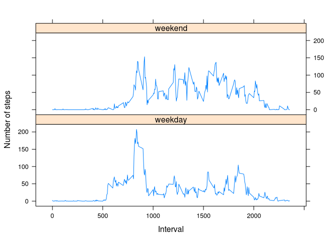

# Reproducible Research: Peer Assessment 1

## Loading and preprocessing the data
Loading the data from my github repo, and converting date values into POXIXct date format. 

```r
temp <- tempfile()
url <- "https://github.com/valpo/RepData_PeerAssessment1/blob/master/activity.zip?raw=true"
download.file(url, temp)
actv <- read.csv(unz(temp, "activity.csv"), stringsAsFactors = FALSE)
actv$date <- as.POSIXct(strptime(actv$date,"%Y-%m-%d"))
```

## What is mean total number of steps taken per day?

```r
ds <- aggregate(steps ~ date, actv, sum)
hist(ds$steps, main = "Histogram of total number of steps per day", xlab = "total number of steps")
```


```r
mean.na <- mean(ds$steps)
median.na <- median(ds$steps)
```
The mean and median of the total number of steps taken per day are 1.0766189\times 10^{4} and 
10765.

## What is the average daily activity pattern?

```r
ds <- aggregate(steps ~ interval, actv, mean)
plot(ds, type="l")
```


```r
daily.max <- ds$interval[which.max(ds$steps)]
```
The 5-minute interval that, on average, contains the maximum number of steps is interval 
835. 

## Imputing missing values
The strategy I am using here is:

1. calculate the mean for each interval with na values if we find values for the same 
   interval on other days. 
   
2. set the step value to zero for all other cases. 


```r
count.na.before <- sum(is.na(actv))
actvNoNa <- actv
ds <- aggregate(steps ~ interval, actv, mean)
noSteps <- is.na(actvNoNa$steps)
actvNoNa$steps[noSteps] <- ds$steps[ds$interval==actvNoNa$interval[noSteps]]
actvNoNa$steps[is.na(actvNoNa$steps)] <- 0
count.na.after <- sum(is.na(actvNoNa))
```
So we replaced 2304 occurences of NA and finally got a data.frame containing
0 NA values. 


```r
ds <- aggregate(steps ~ interval, actvNoNa, mean)
hist(ds$steps, main = "Histogram of total number of steps per day", xlab = "total number of steps")
```


```r
mean.nona <- mean(ds$steps)
median.nona <- median(ds$steps)
```
The mean total number of steps taken per day is 33.0927931, the corresponding median 
is 30.1985772. Do these values differ from the values calculated for the databaset before 
replacing NA values?

```r
mean.na != mean.nona
```

```
## [1] TRUE
```

```r
median.na != median.nona
```

```
## [1] TRUE
```


## Are there differences in activity patterns between weekdays and weekends?

```r
library(lattice) 
actvNoNa$weekday <- ifelse(as.integer(strftime(actvNoNa$date, "%u"))<6,"weekday","weekend")
actvNoNa$weekday <- as.factor(actvNoNa$weekday)
ds <- aggregate(steps ~ interval + weekday, actvNoNa, mean)
densityplot(~steps|weekday,data = ds, 
  	main="Activities by weekdays vs weekends",
   xlab="Steps", 
   layout=c(1,2))
```



```r
xyplot(steps~interval|weekday,data = ds, layout=c(1,2), 
       xlab="Interval", ylab="Number of steps", type="l")
```


